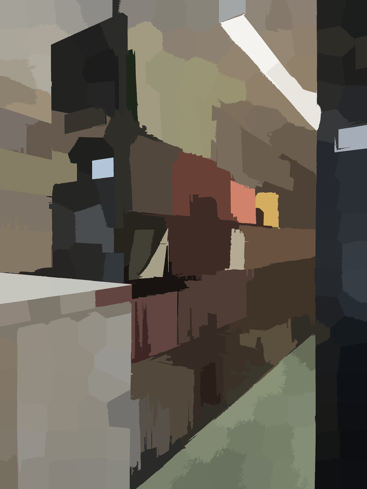
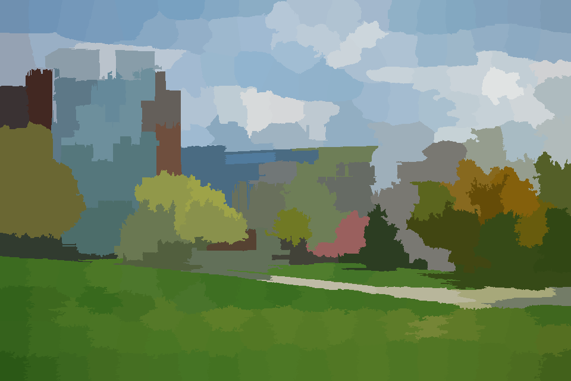

# Assignment 3

This portion of the assignment explores the Simpler Linear Iterative Clustering (SLIC) algorithm, as first described [here](https://doi.org/10.1109/TPAMI.2012.120). 
The code allows for running SLIC segmentation on an image using either my own implementation or the scikit-image library. Scikit's implementation is 
significantly faster (as it is written in Cython). However, I wrote my code for readability and I think it is easier to understand than any other
implementations you'll find online.

## Examples

Note that Scikit's implementation appears to treat the compactness parameter and cluster count differently than my implementation.

|              Input              |                           My SLIC                           |                           Scikit                           |
|:-------------------------------:|:-----------------------------------------------------------:|:----------------------------------------------------------:|
|  |  |  |
|  |  |  |

The original paper briefly mentions moving the centers to the lowest gradient position in a 3×3 neighborhood, but
does not provide many details. It also mentions a "connected components" algorithm to enforce connectivity, and again does not provide much detail.
Both of these are implemented in my code with explanation. Additionally, here is a comparison of the effect of these two techniques.

|                     Basic                     |           Enforcing Connectivity            |       Enforcing Connectivity & Minimizing Gradients        |
|:---------------------------------------------:|:-------------------------------------------:|:----------------------------------------------------------:|
|  |  |  |

## Usage

```bash
python main.py [--image IMAGE] [--output OUTPUT] [--algorithm ALGORITHM] 
               [--clusters CLUSTERS] [--compactness COMPACTNESS] 
               [--iterations ITERATIONS] [--connected CONNECTED]
```

### Arguments

- `--image` (str, required): Path to the input image.
- `--output` (str, default: ""): Path to save the output image. If not provided, the output will be saved in the same directory as the input image.
- `--algorithm` (str, default: "myslic"): Specifies the algorithm to use; choose between "myslic" or "scikit".
- `--clusters` (int, default: 250): Number of clusters to form.
- `--compactness` (float, default: 20): SLIC compactness parameter.
- `--iterations` (int, default: 10): Number of iterations to run.
- `--connected` (bool, default: True): Whether to enforce connectivity of the segments.

### Examples

1. Perform SLIC with default settings:
    ```
    python script.py
    ```

2. Specify custom parameters for SLIC:
    ```
    python script.py --algorithm scikit --clusters 300 --compactness 15
    ```

3. Run SLIC and save the output image to a specific location:
    ```
    python script.py --output output/result.jpg
    ```